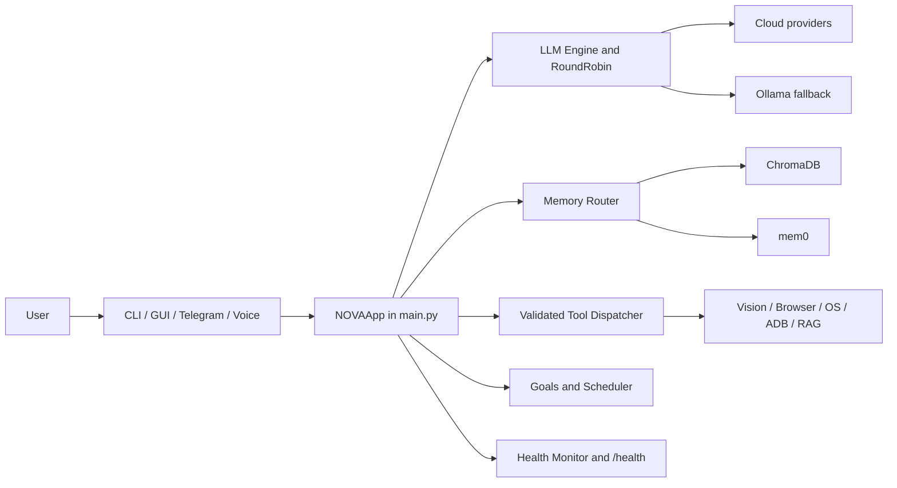

<div align="center">

```text
███╗   ██╗ ██████╗ ██╗   ██╗ █████╗
████╗  ██║██╔═══██╗██║   ██║██╔══██╗
██╔██╗ ██║██║   ██║██║   ██║███████║
██║╚██╗██║██║   ██║╚██╗ ██╔╝██╔══██║
██║ ╚████║╚██████╔╝ ╚████╔╝ ██║  ██║
╚═╝  ╚═══╝ ╚═════╝   ╚═══╝  ╚═╝  ╚═╝
```

# NOVA

**A local-first personal AI assistant for reasoning, memory, voice, vision, and action.**

[](https://www.python.org/)
[](./docker-compose.yml)
[](./tests)
[](https://github.com/vincenzo-afk/NOVA)

[Demo video](./media/nova-overview/renders/nova-overview.mp4) · [Source composition](./media/nova-overview/index.html) · [Report a bug](https://github.com/vincenzo-afk/NOVA/issues/new) · [Request a feature](https://github.com/vincenzo-afk/NOVA/issues/new)

</div>

---

## <a name="table-of-contents"></a>Table of Contents

- [About the Project](#about-the-project)
- [Tech Stack](#tech-stack)
- [Getting Started](#getting-started)
- [Usage](#usage)
- [API Reference](#api-reference)
- [Project Structure](#project-structure)
- [Features and Roadmap](#features-and-roadmap)
- [Testing](#testing)
- [Deployment](#deployment)
- [Contributing](#contributing)
- [Security](#security)
- [License](#license)
- [Acknowledgments](#acknowledgments)
- [References](#references)

---

## <a name="about-the-project"></a>About the Project

NOVA is a Python desktop assistant that places a single orchestration layer over language models, persistent memory, voice I/O, screen understanding, browser and desktop controls, document retrieval, Android Debug Bridge (ADB) tooling, scheduled work, and user-facing interfaces. The application boots through [`main.py`](./main.py), while [`setup.py`](./setup.py) provides the repository’s one-command installation path.

NOVA is designed for workflows that need more than a chat window. It can route requests across configured cloud providers and Ollama, preserve context across named sessions, inspect local screen state, call validated tools, ingest documents, run scheduled goals, and expose a local health endpoint. External integrations remain configurable: cloud services, Telegram, mem0, Gemini, Ollama, OmniParser, ADB, and Tailscale are enabled through environment variables rather than hard-coded credentials.

### Project video

The following overview is an editable HyperFrames composition built specifically from NOVA’s current repository structure and capabilities. The rendered MP4 is committed beside its source so the README remains both a showcase and a reproducible starting point.

<video controls poster="./media/nova-overview/poster.png" width="100%" src="./media/nova-overview/renders/nova-overview.mp4">
  Your browser does not support embedded video. [Open the NOVA overview video](./media/nova-overview/renders/nova-overview.mp4).
</video>

The source lives in [`media/nova-overview/`](./media/nova-overview/). Re-render it with `npx hyperframes check` followed by `npx hyperframes render --quality high --output renders/nova-overview.mp4` from that directory.

### Core capabilities

| Capability | What the repository provides |
|---|---|
| LLM orchestration | Unified request and streaming interfaces, multi-key rotation, network-aware fallback, and Ollama support. |
| Memory and context | mem0 integration, ChromaDB local storage, hybrid retrieval, session isolation, and context trimming. |
| Voice | Wake-word support, voice activity detection, online/offline speech-to-text, text-to-speech, barge-in, and Indic-language fallback paths. |
| Vision and control | Screen capture, Gemini Vision analysis, OmniParser UI mapping, browser automation, keyboard/mouse control, and platform-specific OS access. |
| Documents and web | PDF/DOCX/TXT ingestion, chunking, embeddings, retrieval, search, scraping, crawling, and hybrid ranking. |
| Autonomy | Scheduled tasks, goal execution, step limits, cycle detection, proactive monitoring, usage tracking, and background notifications. |
| Safety and extensibility | Risk scoring, confirmation gates, emergency-stop handling, action logging, plugin loading, Master API, and Master MCP integration. |

### Architecture overview



---

## <a name="tech-stack"></a>Tech Stack

The versions below are taken from [`requirements.txt`](./requirements.txt), [`requirements.lock`](./requirements.lock), [`Dockerfile`](./Dockerfile), and the repository configuration files.

| Area | Technologies |
|---|---|
| Runtime | Python 3.11 container base; Python 3.10+ is the intended language family. |
| Language-model layer | `openai==1.3.5`, `google-generativeai==0.3.0`, Ollama, and the internal RoundRobin/fallback layer. |
| Voice and audio | Porcupine, PyAudio, sounddevice, Silero VAD, faster-whisper, pyttsx3, gTTS, and pynput. |
| Vision and automation | Pillow, OpenCV, PyAutoGUI, Playwright `1.40.0`, Win32 APIs, Quartz/xdotool-compatible platform layers, and OmniParser. |
| Memory and retrieval | mem0ai `0.1.0`, ChromaDB `0.5.0`, sentence-transformers `3.0.0`, rank-bm25 `0.2.2`, and SQLAlchemy `2.0.29`. |
| Documents and web | pypdf `4.0.0`, python-docx `1.1.2`, Requests `2.32.5`, Beautiful Soup `4.12.3`, DuckDuckGo Search, and the internal crawler/ranker. |
| Interfaces | Rich `14.3.3`, PyQt6, python-telegram-bot, pystray, and the voice interface. |
| Scheduling and reliability | APScheduler `3.10.4`, watchdog `4.0.1`, Pydantic `2.12.5`, Loguru `0.7.2`, and pytest `8.4.2`. |
| Infrastructure | Docker Compose, Ollama, ChromaDB, OmniParser, FFmpeg, ADB, and optional Tailscale networking. |

---

## <a name="getting-started"></a>Getting Started

### Prerequisites

For a bare-metal installation, use Python 3.11 or a compatible Python 3.x environment, Git, FFmpeg/`ffplay`, `mpg123`, and Android Platform Tools when Android control is required. Playwright installs Chromium during setup. Ollama is required only for local-model fallback, while cloud providers and integrations require the corresponding accounts or API keys.

For containerized execution, use Docker Engine with the Docker Compose plugin. The supplied [`Dockerfile`](./Dockerfile) is based on Python 3.11 and installs the pinned dependency set from `requirements.lock`; [`docker-compose.yml`](./docker-compose.yml) provisions Ollama, ChromaDB, OmniParser, and NOVA.

### Bare-metal installation

```bash
git clone https://github.com/vincenzo-afk/NOVA.git
cd NOVA
python3 -m venv .venv
source .venv/bin/activate
python -m pip install --upgrade pip
python -m pip install -r requirements.txt
cp .env.example .env
python3 setup.py
```

`setup.py` creates or preserves `.env`, installs Python dependencies, checks system commands, installs Playwright Chromium when available, prepares the OmniParser checkout, warms the configured Whisper model, optionally pulls the configured Ollama model, checks the wake-word asset, and runs post-install health checks. Review the installer before running it on a machine where package installation or startup registration is restricted.

### Configuration

Copy `.env.example` to `.env` and add only the credentials and services you intend to use. `.env` is ignored by Git. The main configuration groups are summarized below; the complete inventory is maintained in [`config/settings.py`](./config/settings.py), [`config/settings_schema.json`](./config/settings_schema.json), and [`.env.example`](./.env.example).

| Group | Important variables |
|---|---|
| LLM | `OPENAI_API_KEYS`, `OPENAI_BASE_URL`, `OLLAMA_BASE_URL`, `OLLAMA_MODEL`, `GEMINI_API_KEYS` |
| Memory and storage | `MEM0_API_KEY`, `DATA_DIR`, `PRIVACY_MODE`, `DEFAULT_SESSION` |
| Voice | `PORCUPINE_ACCESS_KEY`, `PORCUPINE_KEYWORD_PATH`, `DEFAULT_LANG`, `VAD_SILENCE_MS`, `WHISPER_MODEL`, `GEMINI_TTS_MODEL`, `GEMINI_TTS_VOICE` |
| Telegram and Android | `TELEGRAM_BOT_TOKEN`, `TELEGRAM_CHAT_ID`, `TAILSCALE_PHONE_IP`, `ADB_PORT` |
| Vision and services | `OMNIPARSER_SERVER_URL`, `OMNIPARSER_REPO_DIR`, `NOVA_STARTUP_DELAY_SECONDS` |
| Safety and usage | `RISK_CONFIRM_THRESHOLD`, `DAILY_TOKEN_ALERT_THRESHOLD`, `DAILY_TOKEN_HARD_CAP`, `VOICE_BARGEIN_HOTKEY` |
| Proactivity and autonomy | `PROACTIVE_WATCHER_ENABLED`, `PROACTIVE_WATCHER_INTERVAL`, `PHONE_WATCHER_ENABLED`, `AUTONOMY_ENABLED`, `AUTONOMY_POLL_SECONDS`, `AUTONOMY_MAX_STEPS` |
| Optional extensions | `VIRUSTOTAL_API_KEY`, `VIRUSTOTAL_SCAN_WRITES`, `SELF_EVAL_ENABLED`, `NUDGE_ENGINE_ENABLED`, `AMBIENT_MONITOR_ENABLED`, `A2A_ENABLED` |

Never commit API keys, tokens, device identifiers, session exports, logs, or local vector stores. The repository’s ignore rules cover `.env`, `.jarvis*` state, logs, exports, and vendor checkouts.

---

## <a name="usage"></a>Usage

The default entrypoint starts the Rich command-line interface:

```bash
python3 main.py
```

The onboarding layer also recognizes the GUI switch:

```bash
python3 main.py --gui
```

Use the interface to interact with the configured model layer, switch sessions, inspect health, create goals, export conversations, and invoke enabled tools. High-risk actions are routed through the safety layer for confirmation rather than being executed silently.

### Docker Compose

```bash
cp .env.example .env
docker compose up -d
docker compose logs -f nova
```

The compose stack publishes Ollama on port `11434`, OmniParser on port `8000`, ChromaDB on port `8001`, and NOVA’s health service on port `8765` by default. Change host exposure and credentials before using the stack outside a local development environment.

### Rebuilding the README video

```bash
cd media/nova-overview
npm install
npx hyperframes check
npx hyperframes render --quality high --output renders/nova-overview.mp4
```

The video is silent by design and uses inline CSS/GSAP motion so its source remains editable without external media files.

---

## <a name="api-reference"></a>API Reference

NOVA exposes a local health probe from `main.py` for process supervision and Docker health checks. The default bind address is `127.0.0.1` and the default port is `8765`; configure them through `NOVA_HEALTH_BIND_HOST` and `NOVA_HEALTH_PORT` in the settings layer.

| Method | Path | Description |
|---|---|---|
| `GET` | `/health` | Local liveness/health probe used by the container health check and runtime monitoring. |

Example:

```bash
curl http://127.0.0.1:8765/health
```

This is an internal local endpoint, not a public authenticated API. Do not expose it to an untrusted network without adding an appropriate network boundary.

---

## <a name="project-structure"></a>Project Structure

```text
NOVA/
├── main.py                  # Application bootstrap and NOVAApp orchestration
├── setup.py                 # One-command installer and post-install checks
├── config/                  # Settings, schemas, constants, capability discovery
├── core/                    # LLM, memory, reasoning, goals, plugins, dispatcher
├── voice/                   # VAD, wake word, STT, TTS, and voice loop components
├── vision/                  # Screen capture, Gemini Vision, OmniParser, watchers
├── control/                 # Desktop, browser, OS, window, and Android control
├── interfaces/              # CLI, GUI, Telegram, voice, tray, onboarding
├── tasks/                   # Scheduler, goals, maintenance, missions, shortcuts
├── rag/                     # Document loading, chunking, storage, retrieval
├── web/                     # Search, scraping, crawling, and hybrid ranking
├── mcp/                     # Master MCP and API integration layers
├── safety/                  # Guardrails, virus scanning, and emergency stop
├── utils/                   # Logging, notifications, export, usage, health helpers
├── tests/                   # Pytest modules for core behavior and integrations
├── media/nova-overview/     # Editable HTML video source and rendered project video
├── Dockerfile               # Python 3.11 container image
├── docker-compose.yml       # Ollama, ChromaDB, OmniParser, and NOVA services
├── requirements.txt         # Bare-metal dependency manifest
└── requirements.lock        # Container dependency manifest
```

The application keeps runtime state outside the tracked source tree where possible. See `.env.example` and `.gitignore` before enabling persistence, exports, logs, or local vector stores.

---

## <a name="features-and-roadmap"></a>Features and Roadmap

The current codebase includes the principal orchestration layers for LLM routing, persistent memory, context trimming, voice interfaces, screen understanding, desktop/browser control, ADB support, document retrieval, scheduling, goal execution, safety guardrails, plugins, MCP/API integration, health monitoring, and multiple user interfaces.

The project’s next useful milestones are operational rather than cosmetic: keep platform-specific setup paths reliable, expand integration tests around optional services, document supported model/provider combinations, and maintain the local-first privacy controls as new capabilities are added. The repository intentionally keeps several integrations disabled by default, including autonomy, ambient monitoring, phone watching, and agent-to-agent features.

For implementation history, use the repository’s [commit log](https://github.com/vincenzo-afk/NOVA/commits/main) and [issues](https://github.com/vincenzo-afk/NOVA/issues).

---

## <a name="testing"></a>Testing

NOVA uses pytest modules under [`tests/`](./tests). Run the suite from an activated virtual environment:

```bash
python -m pytest tests -q
```

For a dependency-light syntax check across the Python source tree, run:

```bash
python -m compileall -q .
```

Tests that exercise optional integrations mock their external boundaries where appropriate. Full voice, GUI, browser, OmniParser, ADB, and model-provider behavior still depends on the local services and system permissions described in the configuration and installation sections.

---

## <a name="deployment"></a>Deployment

### Local development

Use the bare-metal installation path when you need direct access to the desktop, microphone, wake-word listener, Android Platform Tools, or platform-specific automation APIs. Run `python3 main.py` from the repository root after configuration.

### Docker Compose

Use `docker compose up -d` for a service-oriented deployment with Ollama, ChromaDB, OmniParser, and NOVA. The compose file mounts local assets, logs, exports, and runtime state as described in [`docker-compose.yml`](./docker-compose.yml). The Docker deployment disables several host-specific interactions by default and should be treated as a local/server deployment rather than a drop-in desktop-control environment.

No cloud deployment manifest is included in this repository. Production hosting, public ingress, secret management, backups, and access control must be designed for the target environment instead of inferred from the local compose file.

---

## <a name="contributing"></a>Contributing

Start by creating a branch from `main`, make one focused change, and add or update tests when behavior changes. Before opening a pull request, run the pytest suite, compileall check, and any relevant local integration checks. Keep secrets, device state, logs, exports, and generated vendor directories out of commits.

Pull requests should explain the intent, affected modules, test commands and results, configuration changes, platform assumptions, and any security or privacy impact. Prefer clear, imperative commit subjects such as `fix: guard empty goal state` or `docs: clarify Docker configuration`.

Because NOVA spans platform-specific runtimes and optional services, contributions should preserve graceful fallback behavior and should not make a cloud service, GUI toolkit, device, or operating-system API mandatory for unrelated workflows.

---

## <a name="security"></a>Security

NOVA handles model credentials, local files, screen content, microphone input, device controls, conversation history, and action logs. Keep `.env` outside version control, use the repository’s privacy settings intentionally, and review the safety guardrails before enabling automation or autonomy.

The codebase includes Pydantic validation, SSRF-oriented web checks, plugin restrictions, confirmation thresholds, emergency-stop persistence, secret redaction in exports, and configurable local-only behavior. These controls reduce risk but do not constitute a complete security boundary for untrusted plugins or host-level automation.

For a sensitive vulnerability report, use GitHub’s private vulnerability-reporting option for the repository when it is enabled; otherwise contact the repository owner through the [NOVA GitHub profile](https://github.com/vincenzo-afk). Do not publish credentials, personal data, or exploit details in a public issue.

---

## <a name="license"></a>License

This repository does not currently contain a `LICENSE` file or declare a license in GitHub metadata. Until the maintainer adds an explicit license, treat the source as **all rights reserved** and request permission before redistributing or using it beyond applicable legal exceptions.

---

## <a name="acknowledgments"></a>Acknowledgments

NOVA builds on the Python ecosystem and several specialized open-source projects, including Ollama, ChromaDB, mem0, sentence-transformers, faster-whisper, Silero VAD, Playwright, PyAutoGUI, OmniParser, APScheduler, Pydantic, Rich, and the Python standard library. Their licenses and notices remain the responsibility of their respective upstream projects and should be reviewed before redistribution.

The repository is maintained by [`vincenzo-afk`](https://github.com/vincenzo-afk).

---

## <a name="references"></a>References

The README’s project facts are grounded in the repository’s source and configuration files: [`main.py`](./main.py), [`setup.py`](./setup.py), [`requirements.txt`](./requirements.txt), [`requirements.lock`](./requirements.lock), [`config/settings.py`](./config/settings.py), [`config/settings_schema.json`](./config/settings_schema.json), [`Dockerfile`](./Dockerfile), [`docker-compose.yml`](./docker-compose.yml), [`tests/`](./tests), and [`.env.example`](./.env.example).

---

<div align="center">

[Back to top](#nova)

**NOVA — transparent, extensible, and yours.**

</div>
